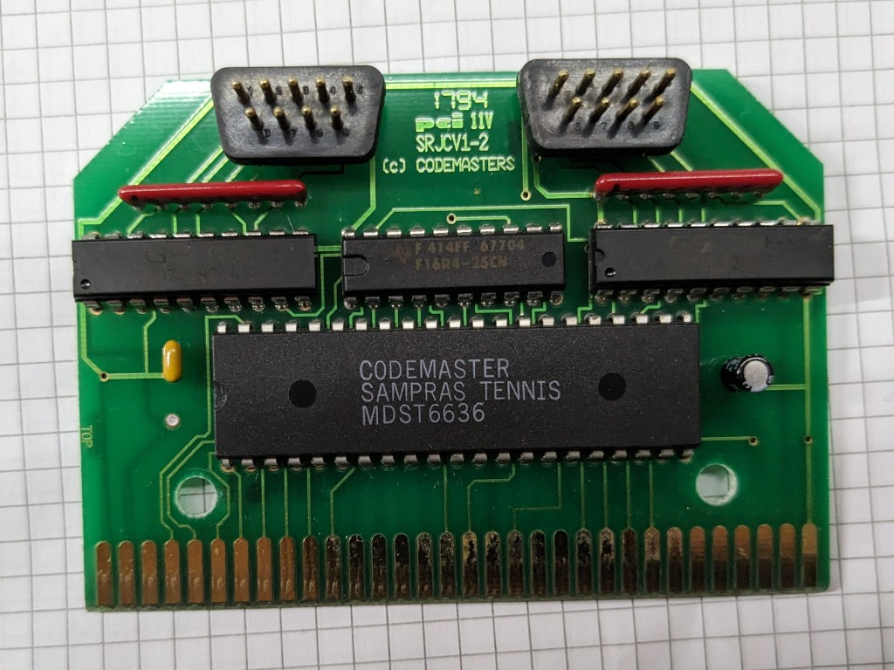

# Codemasters' J-Cart reverse engineering

## Introduction

I found this cart at the fleamarket. I think adding two game ports to a Megadrive is a cool thing, so I decided to reverse engineer it.

TODO: Write a decent intro.

## Notes

- Notes on the memory mapping of this cart can be found in the [MAME repository](https://github.com/mamedev/mame/blob/master/src/devices/bus/megadrive/jcart.cpp)

## Credits

- Cart edge symbol from [FeRAM](https://github.com/soniccd123/Genesis-FeRAM-Cart/)
